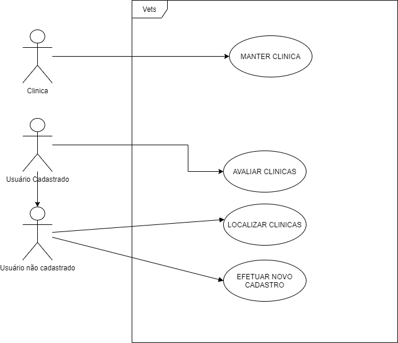
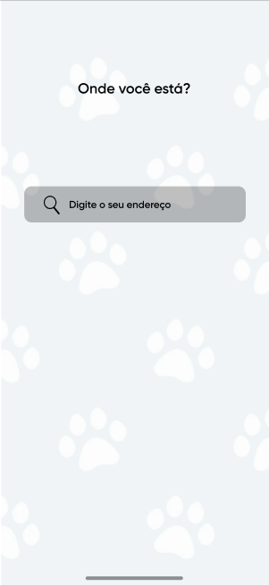
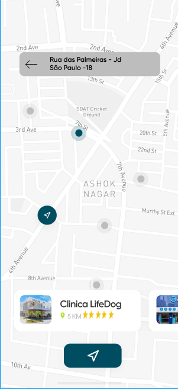
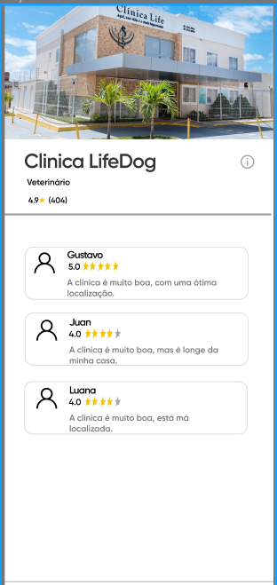

# Vets

A Vets irá conectar as clínicas veterinárias e usuários donos de pets em geral, assim facilitando a procura de uma clínica quando necessário, informação que nem sempre é fácil achar pela internet.
A versão final estará disponível em web e aplicativo mobile, onde um usuário conseguirá localizar clínicas veterinárias e petshops mais próximos assim como seus serviços e contatos. As clínicas poderão ser
avaliadas por usuários cadastrados, sendo como diferencial o ranking de avaliação para quem busca o melhor atendimento para os seus pets.

## 2. Especificação Funcional.

- [X] Localização de Clínicas: 

Deve haver uma interface de localização das clínicas e
estabelecimentos próximos e podendo visualizar mais informações sobre os mesmos, como
contato, serviços oferecidos e avaliações, sendo opcional ser conforme a localização do usuário
ou não, e não é obrigatório estar logado na plataforma para localizar os provedores de serviços.

- [X] Avaliação das Clínicas:

Nas telas de informações das clínicas, haverá um espaço para avaliação das mesmas, onde usuário cadastrados e logados podem inserir uma curta resenha sobre a
clínica, que poderão ser visualizadas por todos os utilizados junto as principais informações da
clínica em si.

- [X] Portabilidade:

A aplicação deverá funcionar tanto em web quanto em smartphones que possuem acesso à internet.

### Progresso e controle das etapas implementadas: 

Protótipo:
https://www.figma.com/file/X27m5nEAEblDtBgHckaOiD/Vets?node-id=0%3A1

### Projeto Versão 1.0: Telas propostas para o Front-end.

 |   

### Checklist.

- Index
    - [ ] Animação de abertura para a versão mobile
    - [ ] Associação entre páginas
- Endereço
    - [x] Desenho da tela
    - [x] Capturar o endereço inserido (latitude e longitude)
    - [ ] Vincular com a tela Maps levando o endereço do usuário
    - [x] Ajustar Formatação
 
- Maps
    - [x] Desenho da tela
    - [x] Retornar as clínicas no mapa
    - [x] Capturar a localização do Usuário(Captura de input do usuário)
    - [ ] Ajustar Formatação

- Detalhes
    - [x] Desenho da tela
    - [ ] Vincular com Backend para retornar detalhes da Clínica
    - [ ] Ajustar Formatação
    - [ ] Campo Inserção de Avaliação
    - [ ] Integração Firebase

## Tecnologias usadas no Front-and.  

- HTML
- CSS
- JavaScript
- Api GoogleMap
    - Geocode
    - Places
    - Map Javascript API

    ## Tecnologias usadas no Back-end.

- Java
- Spring Web
- Spring Boot
- Maven
- Testes Unitários (MockMVC e Junit 4)  
- Google Cloud Platform
- Maps/Places API
- Herokku (Cloud Deploy/CI)
- CORS